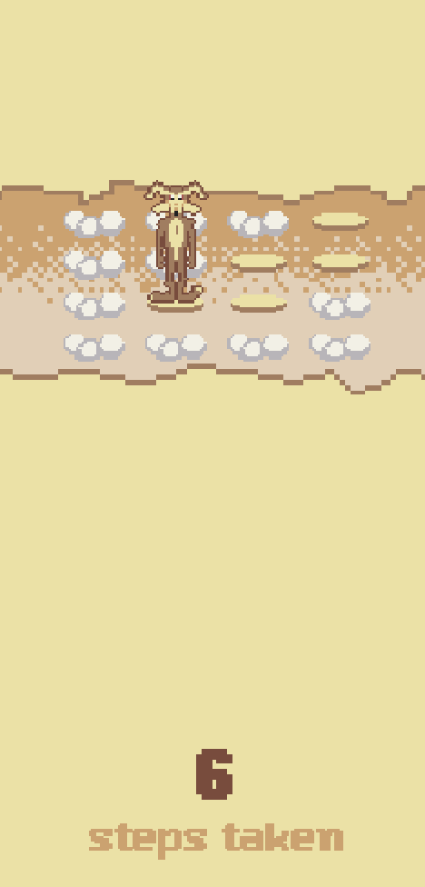

# Falling is learning

A minimalist puzzle game where players control a coyote character trying to
reach the other side of each level. The platforms are hidden by clouds, and
you'll need to carefully discover the safe path while avoiding falls.

## Playing

Head over to itch.io: https://sqddy.itch.io/falling-is-learning

- Press SPACE to start the game from the title screen
- Use arrow keys to move the coyote:
  - ← → to move left and right
  - ↑ ↓ to move up and down
- Find the safe path across the platforms
- Avoid falling through the clouds
- Reach the other side to complete each level

## Credits

* Built with [Pyxel](https://github.com/kitao/pyxel)
* Font by Paul Spades (https://www.pentacom.jp/pentacom/bitfontmaker2/gallery/?id=346)

## Why?

I started this project as a way to learn game development. The code is not the
main focus currently but rather the pixel art, which I enjoy a lot creating
myself.

The theme of the game is inspired ;) by the [Coyote and Road
Runner](https://en.wikipedia.org/wiki/Wile_E._Coyote_and_the_Road_Runner)
cartoons.
